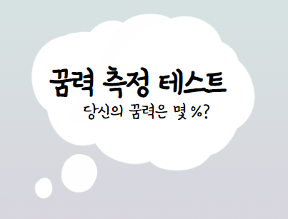

   
   
  https://dream.swygbro.com/
   

## 프로젝트 소개

꿈을 꾸는 환경, 내용에 따른 간단한 심리테스트 유형의 서비스입니다.

[🎯서비스 소개 자세히 보러가기](https://www.swygbro.com/contents/e208c998-567c-4b58-a847-269a26e8a3b5)

## 기술 스택

  
  
  
  

 

## 구현 기능

### 기능 1

### 기능 2

### 기능 3

### 기능 4

 

## 기술 블로그

 

## 라이센스

기획자 : 선예지 | 개발자 : 서현석 
<a href="https://www.swygbro.com/" target="_blank">Prod By. SWYG</a> 
Copyright &copy; 꿈력 측정 테스트 All Rights Reserved.

